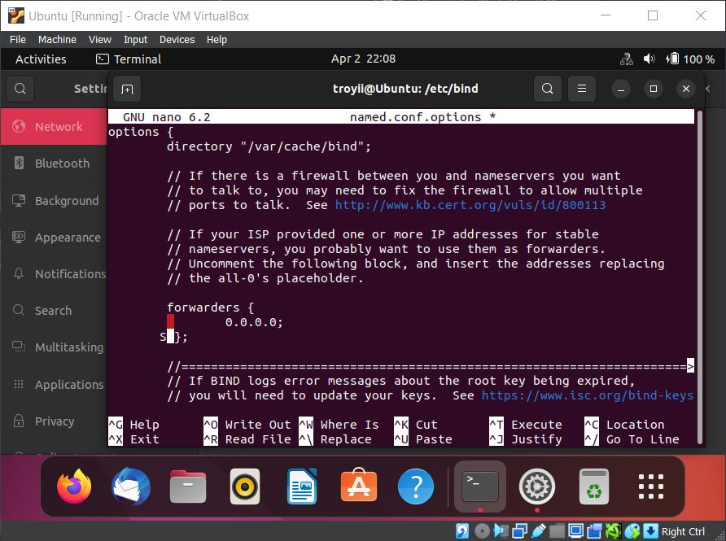
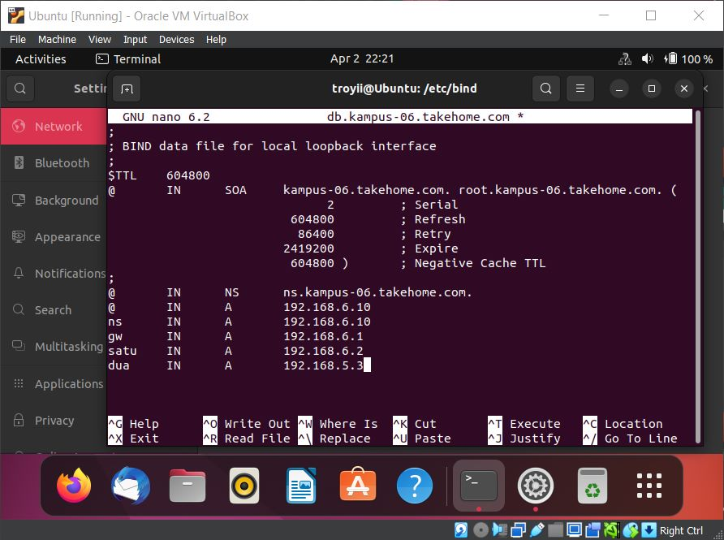
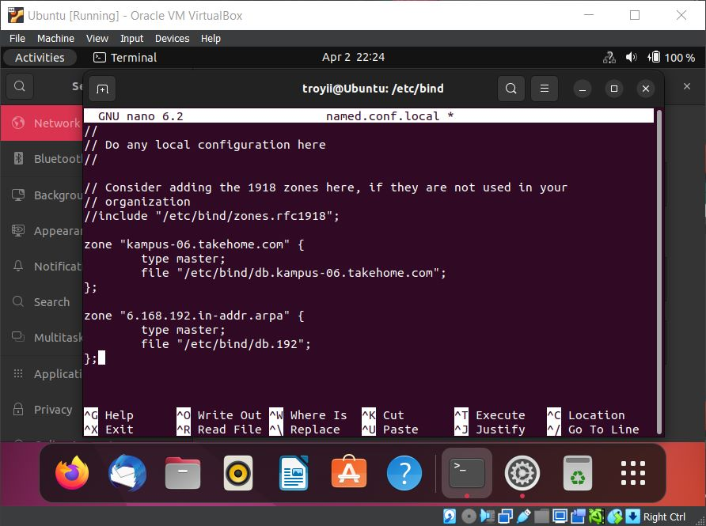
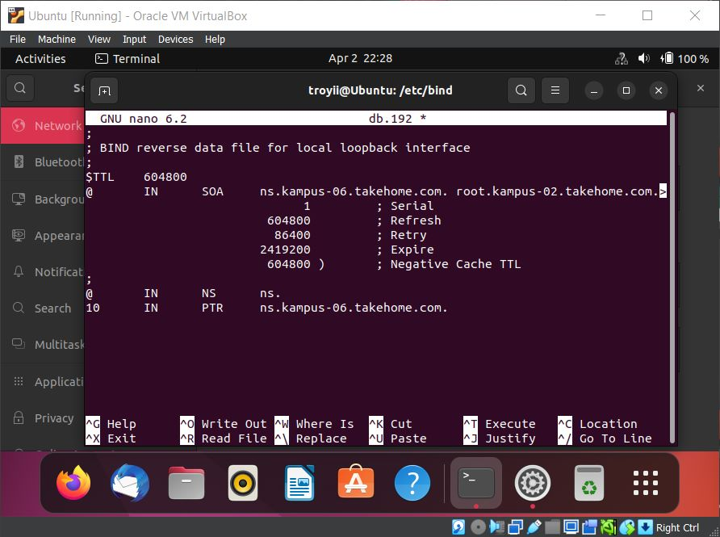
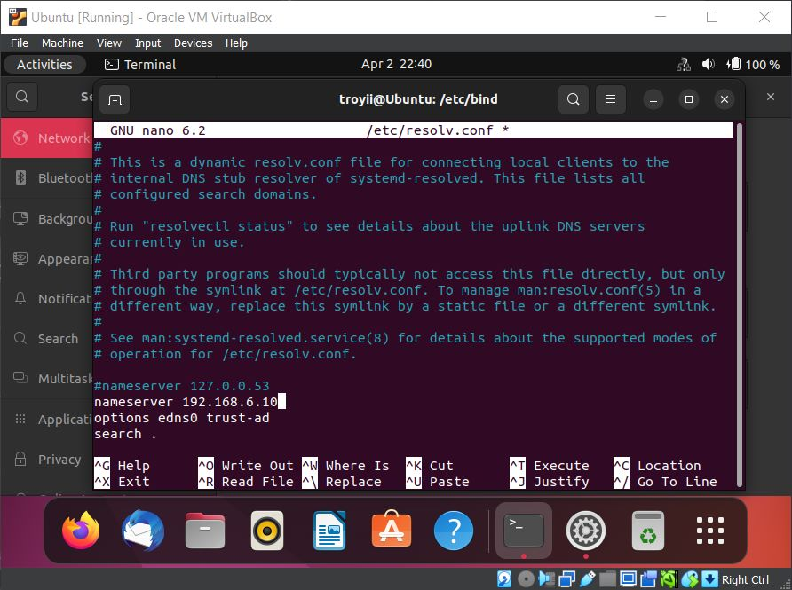
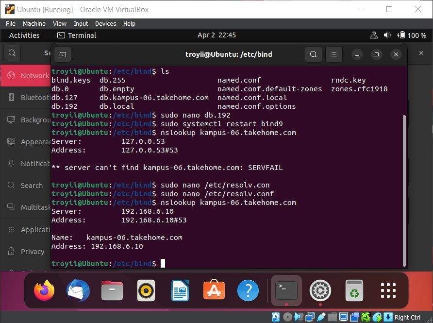

## **Laporan Praktikum Workshop Administasi Jaringan**
# **DNS**
### Dosen Pengampu : Dr. Ferry Astika Saputra ST, M.Sc

&nbsp;

## **Kelompok 6**
1. Troy Fredellius Ardystama (3121600038)
2. Nicholaus Adhyatma Surya Kusuma (3121600049)
3. Cantika Putri Romadhona (3121600051)

&nbsp;

### **Domain Name Service (DNS)**
---
DNS atau Domain Name Service adalah sebuah sistem yang digunakan untuk menerjemahkan nama domain menjadi alamat IP yang sesuai. Setiap komputer yang terhubung ke internet memiliki alamat IP yang unik, namun alamat IP ini sulit diingat dan sulit diketik oleh manusia. Oleh karena itu, DNS diciptakan untuk memudahkan penggunaan internet dengan menghubungkan nama domain dengan alamat IP yang sesuai. Dengan menggunakan DNS, pengguna internet dapat mengakses situs web dengan mudah hanya dengan mengetikkan nama domain pada browser, tanpa harus mengingat alamat IP yang rumit.

&nbsp;

### **Installation**
---
Untuk menginstall BIND9, jalankan perintah berikut pada terminal
````
sudo apt install bind9
````

&nbsp;

### **Caching Nameserver**
---
Konfigurasi default bertindak sebagai *caching server*. Cukup hapus komentar dan edit bagian *forwarders* di ``` /etc/bind/named.conf. ``` untuk mengatur alamat IP server DNS ISP Anda.



Untuk mengaktifkan konfigurasi baru, mulai ulang server DNS. Dari prompt terminal dengan perintah berikut:
```
sudo systemctl restart bind9.service
```

&nbsp;

### **Forward Zone File (Domain ke IP)**
---
Untuk menambahkan zona DNS ke BIND9 dan mengubah BIND9 menjadi server Primer, edit bagian ```/etc/bind/named.conf.local```:


Sekarang gunakan *zone file* yang sudah ada sebagai template untuk membuat berkas ```/etc/bind/db.example.com``` dengan menggunakan perintah berikut:

```
sudo cp /etc/bind/db.local /etc/bind/db.example.com
```

*Forward Zone File*:



Restart BIND9 agar perubahan dapat diterapkan:

```
sudo systemctl restart bind9.service
```

&nbsp;

### **Reverse Zone File (IP ke Domain)**
---
Sekarang setelah zona disiapkan dan mengubah nama domain menjadi Alamat IP, zona Reverse perlu ditambahkan untuk memungkinkan DNS mengubah Alamat IP menjadi nama. Edit pada bagian ```/etc/bind/named.conf.local``` dan tambahkan syntax berikut:

```
zone ”1.168.192.in−addr.arpa”{
    type master;
    file”/etc/bind/db.192”;
};
```



Sekarang, buat file ```/etc/bind/db.192:``` dengan perintah:

```
sudo cp /etc/bind/db.127 /etc/bind/db.192
```

Selanjutnya, edit ```/etc/bind/db.192``` dengan mengubah opsi yang sama dengan ```/etc/bind/db.example.com```:

*Reverse Zone File*:



Setelah membuat *Reverse Zone File*, mulai ulang BIND9:

```
sudo systemctl restart bind9.service
```

### **Testing**
---
Langkah pertama dalam menguji BIND9 adalah menambahkan Alamat IP nameserver ke host resolver. Nameserver utama
harus dikonfigurasi seperti halnya host lain untuk memeriksa ulang berbagai hal. Buka DNS client
untuk mengetahui detail tentang cara menambahkan alamat nameserver ke network client. Edit nameserver dan parameter untuk domain pada file ```/etc/resolv.conf```:



*nslookup*

