## **Laporan Praktikum Workshop Administasi Jaringan**
# **Hostname**
### Dosen Pengampu : Dr. Ferry Astika Saputra ST, M.Sc

&nbsp;

## **Kelompok 6**

1. Troy Fredellius Ardystama (3121600038)
2. Nicholaus Adhyatma Surya Kusuma (3121600049)
3. Cantika Putri Romadhona (3121600051)

&nbsp;

### **Setting IP**
---
- Buka konfigurasi Mikrotik menggunakan winbox -> IP -> Address
- Tambahkan 2 Interface sebagai berikut
```
eth1 :
     - Address : 10.252.108.16.
     - Network : 10.252.108.0
eth2 :
    - Address : 192.168.2.1
    - Network : 192.168.2.0
```
Screenshot
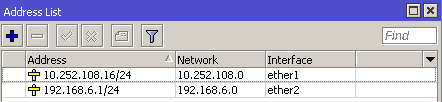

&nbsp;

### **Setting Default gateway 0.0.0.0/0 & IP route gateway 10.252.108.212**
---
- Pilih menu IP -> Routes
- Tambahkan routingan baru dan konfigurasi default gateway-nya

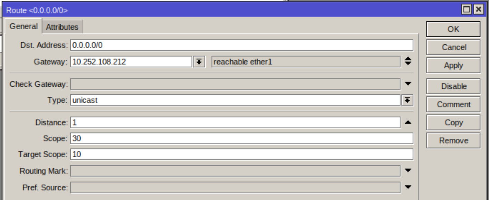

&nbsp;

### **Setting DHCP Server via DHCP Setup menjadi 192.168.X.100 - 192.168.X.254**
---
- Pilih menu IP -> DHCP Server -> Klik DHCP Setup
- Pada jendela DHCP Server Interface pilih ether2
- Selanjutnya, ketika diminta menentukan IP Address yang akan digunakan sebagai default-gateway oleh DHCP Client masukkan IP 192.168.6.100 - 192.168.6.254

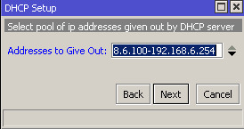

&nbsp;

### **Sambungkan PC atau laptop ke jaringan, cek IP address pastikan IP add dari PC mendapatkan IP add dari dhcp server**
---
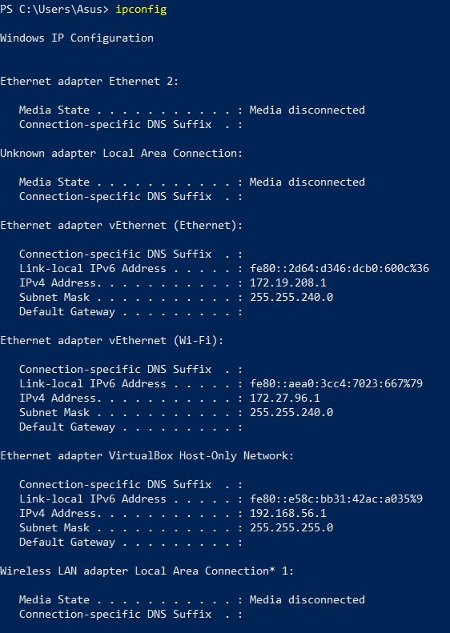

&nbsp;

### **Power up nyalakan VM, pastikan konfigurasi jaringan BRIDGE dan pastikan mendapatkan IP add dari dhcp server**
---
- Konfigurasikan BRIDGE pada VM yang digunakan dengan cara klik Network configuration di VM => Ubah menjadi BRIDGE Adapter

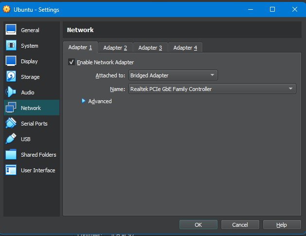

&nbsp;

### **Konfigurasi IP VM Menjadi Static IP : 192.168.X.10**
---
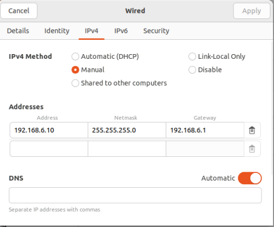

&nbsp;

### **Konfigurasi NTP ke 0. id.pool.ntp.org 1. id.pool.ntp.org**
---
1. Set Up NTP Client Mengubah Pengaturan jam Sistem
- Untuk melihat daftar zona waktu menjalankan perintah :
```
sudo timedatectl set-timezone Asia/Jakarta
```
- Mengatur RTC ke UTC, menjalankan perintah
```
sudo timedatectl set-local-rtc false
```
2. install NTP server Sebelum melakukan install maka perlu mengubah kembali IP jaringan yang sebelumnya static menjadi DHCP kembali.
- Pertama update terlebih dahulu server dengan menggunakan perintah
```
sudo apt update && sudo apt -y upgrade
```
- Menginstall NTP Srver menggunakan perintah :
```
sudo apt -y install ntp
```
3. Konfigurasi NTP Server
- Mengedit ntp.conf dengan menggunkan perintah :
```
sudo nano /etc/ntp.conf
```
- Memberikan command pada :
```
#pool 0.ubuntu.pool.ntp.org iburst 
#pool 1.ubuntu.pool.ntp.org iburst 
#pool 2.ubuntu.pool.ntp.org iburst
#pool 3.ubuntu.pool.ntp.org iburst 
#pool 4.ubuntu.pool.ntp.org iburst 
#pool 5.ubuntu.pool.ntp.org iburst
```
- Menambahkan baris
```
server 0.id.pool.ntp.org
server 1.id.pool.ntp.org
```
- Restart NTP
```
sudo systemctl restart ntp
```
- Mengkonfirmasi apakah NTP service telah aktif menggunkan perintah :
```
systemctl status ntp
```
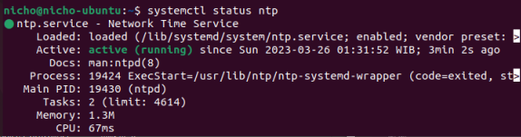
- Cek keberhasilan konfigurasi dengan command :
```
ntpq -p
```
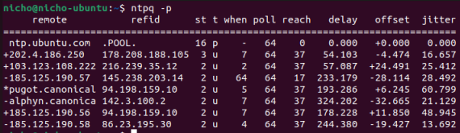
- Mengecek kembali settingan waktu dan tanggal menggunakan perintah
```
timedatectl
```
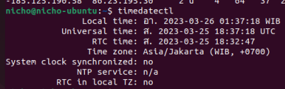

&nbsp;

### **Konfigurasi Sudo**
---
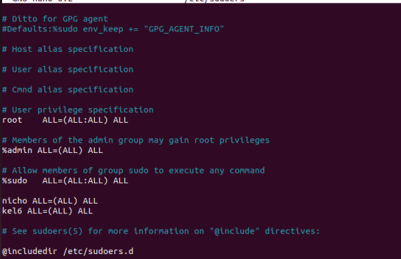

&nbsp;

### **Ganti hostname VM server10.kelompokX.takehome.com**
---
- Sebelum menghubahnya, bisa dicek terlebih dahulu saat ini nama dari hostname sebelum diubah.image.png

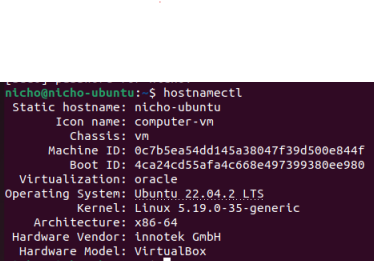
- Untuk mengubahnya gunakan command dibawah
```
sudo hostnamectl set-hostname server10.kelompok6.takehome.com
```
- Setelah itu cek kembali hostnamenya

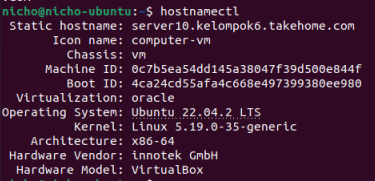