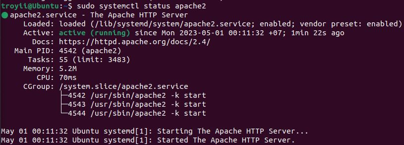
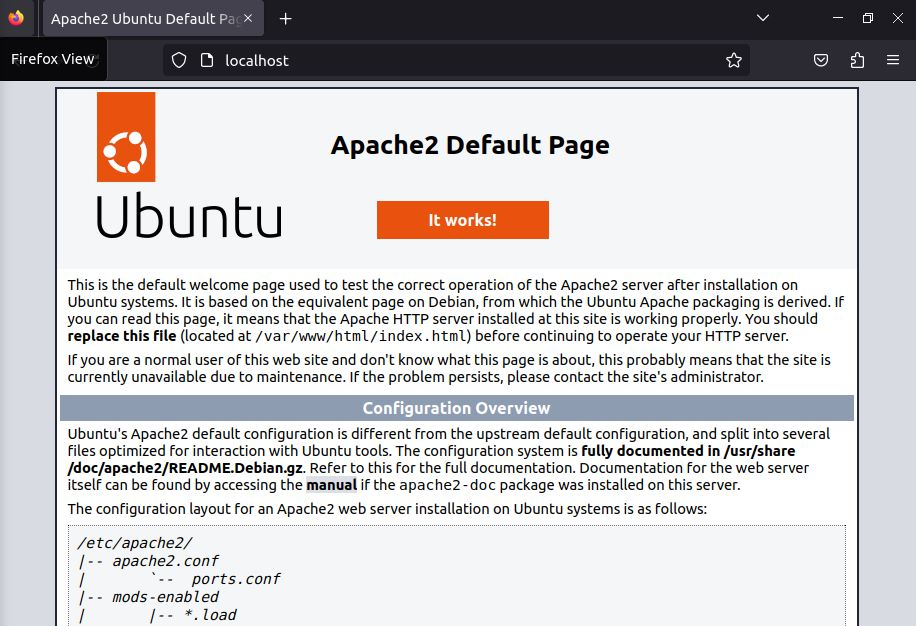
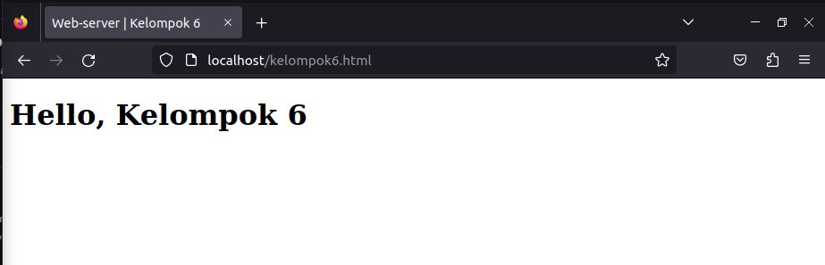
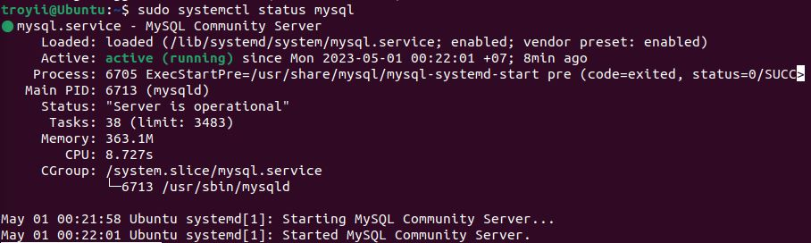
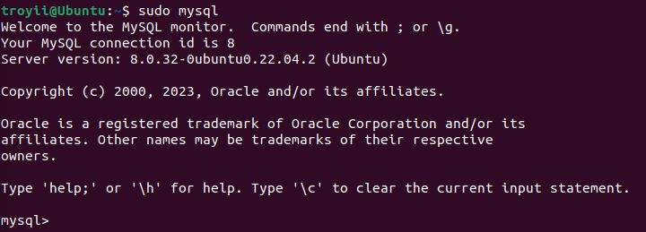
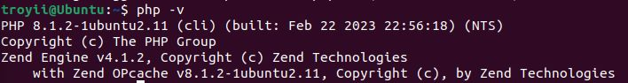

## **Laporan Praktikum Workshop Administasi Jaringan**
# **Instalasi WebServer**
### Dosen Pengampu : Dr. Ferry Astika Saputra ST, M.Sc

&nbsp;

## **Kelompok 6**
1. Troy Fredellius Ardystama (3121600038)
2. Nicholaus Adhyatma Surya Kusuma (3121600049)
3. Cantika Putri Romadhona (3121600051)

&nbsp;

### **Langkah 1 : Instalasi Apache**
---
- Update repo lokal
  ```sh
  sudo apt udate
  ```

- Lalu install paket apache dengan command
  ```sh
  sudo apt install apache2
  ```
  
  Setelah mengonfirmasi instalasi, apt akan menginstal Apache dan semua dependensi yang diperlukan.

- Setelah instalasi selesai, pastikan layanan Apache berjalan dengan baik dengan menjalankan perintah:
  ```sh
  sudo systemctl status apache2
  ```

  Hasil :
  

- Jika layanan Apache tidak berjalan, Anda dapat memulainya dengan menjalankan perintah:
  ```sh
  sudo systemctl start apache2
  ```

- Setelah itu, buka browser dan masukkan alamat IP server Anda. Anda akan melihat halaman selamat datang Apache.

  

- Jika Anda ingin mengakses halaman web yang dibuat di dalam direktori /var/www/html, pastikan hak akses ke direktori tersebut sudah diatur dengan benar. Anda bisa memberikan akses ke pengguna www-data dengan perintah:
  ```sh
  sudo chown -R www-data:www-data /var/www/html
  ```

- Sekarang, Anda dapat membuat file HTML di dalam direktori /var/www/html dan mengaksesnya di browser.

  

&nbsp;

### **Langkah 2 : Instalasi MySql**
---
- Instal paket mysql dengan perintah
  ```sh
  sudo apt-get install mysql-server
  ```

- Setelah instalasi selesai, pastikan layanan MySQL berjalan dengan baik dengan menjalankan perintah:
  ```sh
  sudo systemctl status mysql
  ```

  

- Jika layanan MySQL tidak berjalan, Anda dapat memulainya dengan menjalankan perintah:
  ```sh
  sudo systemctl start mysql
  ```

- Setelah itu, jalankan perintah untuk melakukan pengaturan awal keamanan MySQL:
  ```sh
  sudo mysql_secure_installation
  ```

  Ikuti instruksi dan jawab pertanyaan yang muncul. Anda akan diminta untuk mengatur password root dan menghapus beberapa user dan database yang tidak diperlukan.

- Sekarang, Anda dapat masuk ke MySQL dengan menggunakan perintah:
  ```sh
  sudo mysql
  ```

  

  &nbsp;

### **Langkah 3 : Instalasi PHP**
---
- Install php dengan perintah :
  ```sh
  sudo apt install php
  ```

- Setelah instalasi selesai, pastikan PHP berjalan dengan baik dengan menjalankan perintah:
  ```sh
  php -v
  ```

  