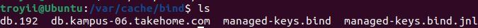
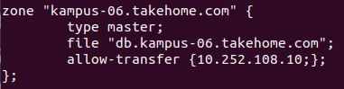
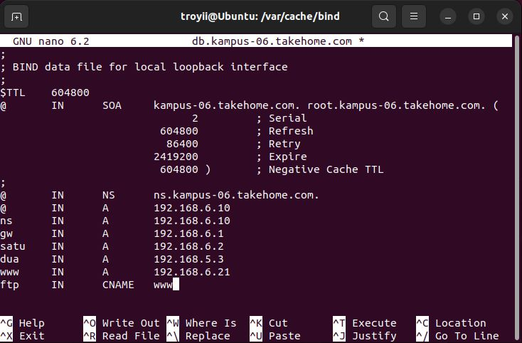
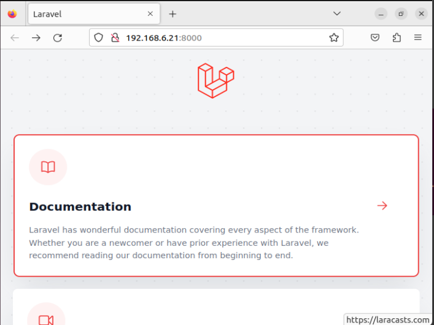

## **Laporan Praktikum Workshop Administasi Jaringan**
# **Instalasi WebServer**
### Dosen Pengampu : Dr. Ferry Astika Saputra ST, M.Sc

&nbsp;

## **Kelompok 6**
1. Troy Fredellius Ardystama (3121600038)
2. Nicholaus Adhyatma Surya Kusuma (3121600049)
3. Cantika Putri Romadhona (3121600051)

&nbsp;

### **1. Konfigurasi DNS**
---
- Pindahkan file konfigurasi dns yang sebelumnya berada pada ``/etc/bind`` ke ``/var/cache/bind``
  
  

- Kemudian pada file ``named.conf.local`` pada direktori ``/etc/bind`` tambahkan ``allow transfer { ip address ;};`` seperti gambar di bawah :

  

- Penambahan ``allow-transfer {10.252.108.10;};`` pada konfigurasi zona tersebut digunakan untuk memberi izin transfer zona ke alamat IP ``10.252.108.10`` yang memungkinkan server DNS lain untuk menyalin catatan zona tersebut, fungsinya untuk melakukan sinkronisasi zona antara server DNS yang berbeda. Agar server DNS lain yang memiliki IP ``10.252.108.10`` dapat menyalin catatan di zona "kampus-06.takehome.com" dari server DNS BIND ini.
- Tambahkan ip client ke file db.kampus-06.takehome.com pada wwww seperti gambar dibawah :

  

&nbsp;

### **2. Instalasi Laravel pada client web server**
---
- Install composer dengan perintah
  ```sh
  curl -sS https://getcomposer.org/installer -o /tmp/composer-setup.php
  ```

- Install Laravel dengan perintah
  ```sh
  composer create-project laravel/laravel example-app
  ```

- Jalankan Laravel dengan perintah
  ```sh
  php artisan serve --host={ip_client} --port=8000
  ```

  